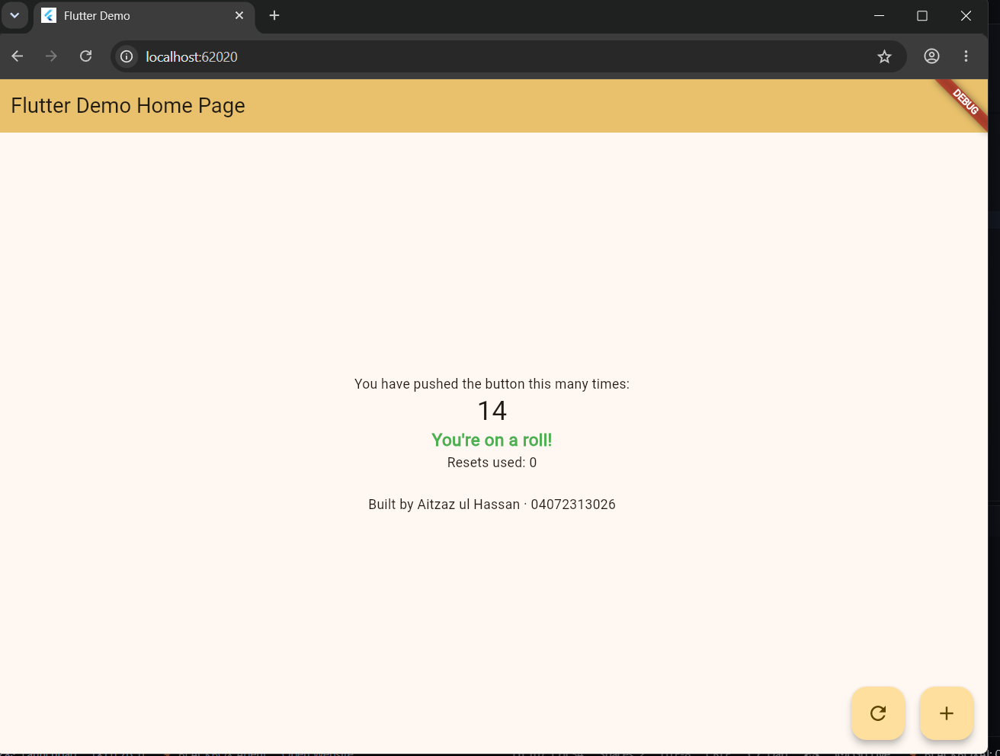

Aitzaz ul hassan
04072313026

what/why setstate does:

when we update any data in the code using setstate this tells the flutter somthing changed and the screeen should rebuilt orr restructured again without this the new change will not appear on the screen and doesnot show any kind of changes in the ui we majorly use this when we want to see the change on the screen after changing thr data When we change a value without using setState Flutter may not know that the value changed so the new value will not appear on the screen
